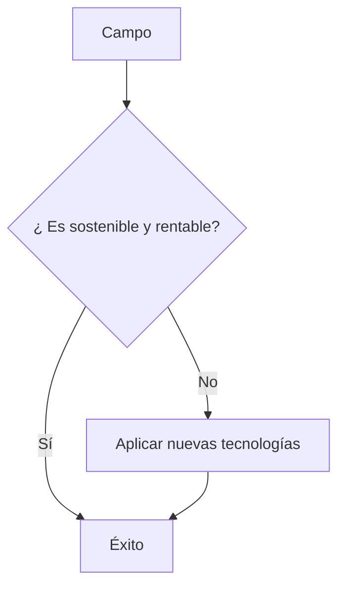

<!--- Uso HTML para poner una imagen ya que en Markdown no puedo alinearla a la derecha aunque he pensado usar algún truco
como rellenar con espacios en blanco o insertar una imagen transparente delante, me parecía un poco cutre--->

# Rodrigo Gómez Fernández
## Estudiante a tiempo parcial   CIFPD ["La Conservera"](http://www.fplaconservera.es) Ceutí 📖

### ⏳ Técnico superior en desarrollo de aplicaciones multiplataforma
### Cargando...⏳

<!--- La siguiente lista gracias al flavor de Github para Markdown (GFM) --->
- [X] Iniciando curso
    - [ ] Bases de datos
      - SQLServer
      - Oracle
      - MySQL
      - Postgre
    - [ ] Programación
      - Java
      - Python
      - C++
    - [ ] Lenguajes de marcas
      - HTML
      - CSS
      - XML
      - Markdown

## Trabajador apasionado del campo 🌱

* Agricultura regenerativa
* Agricultura sostenible

<!--- Gracias a Mermaid, que es un flavor de Markdown soportado por Github, puedo hacer el siguiente diagrama -->

<!--- Emojis para posible uso  🎓 📖 🌄 --->
