<!--- Uso HTML para poner una imagen ya que en Markdown no puedo alinearla a la derecha aunque he pensado usar algún truco
como rellenar con espacios en blanco o insertar una imagen transparente delante, me parecía un poco cutre.
La imagen es el Octocat, la mascota de Github--->

# Rodrigo Gómez Fernández
## Estudiante a tiempo parcial   CIFPD ["La Conservera"](http://www.fplaconservera.es) Ceutí 📖

###  Habilidades actuales

| SqlServer | C++ | PHP  |
|:-------------:|:---------------:|:-------------:|
|  |  |   |

###  Actualmente cursando
### Técnico superior en desarrollo de aplicaciones multiplataforma

<!--- La siguiente lista gracias al flavor de Github para Markdown (GFM) --->
- [X] Iniciando curso
    - [ ] Bases de datos
        | Postgre       | Oracle       | MySql      |
        |:-------------:|:---------------:|:-------------:|
        |  |  |  |
    - [ ] Programación
        | Java       | Python       |
        |:-------------:|:---------------:|
        |  | |
    - [ ] Lenguajes de marcas
        | Markdown       | HTML       | XML      | CSS      |
        |:-------------:|:---------------:|:-------------:|:-------------:|
        |  |  |  | |

## Trabajador apasionado del campo 🌱

* 🌄 [Agricultura regenerativa](https://es.wikipedia.org/wiki/Agricultura_regenerativa)
  * Sensores IoT (Internet of the Things).
* 🍎 [Agricultura sostenible](https://es.wikipedia.org/wiki/Agricultura_sostenible)
* 🚜 [Agricultura de precisión](https://es.wikipedia.org/wiki/Agricultura_de_precisi%C3%B3n)
  * Guiado automático.
  * Mapeado GPS.

```mermaid
graph TD;
    A[Campo];
    A --> B{¿ Es sostenible y rentable?};
    B -->|Sí| D;
    B -->|No| C ;
    C[Aplicar nuevas tecnologías] --> D[Éxito];
```

<!--- Gracias a Mermaid, que es un flavor de Markdown soportado por Github, puedo hacer el siguiente diagrama -->

