<!--- Uso HTML para poner una imagen ya que en Markdown no puedo alinearla a la derecha aunque he pensado usar algún truco
como rellenar con espacios en blanco o insertar una imagen transparente delante, me parecía un poco cutre--->

# Rodrigo Gómez Fernández
## Estudiante a tiempo parcial   CIFPD ["La Conservera"](http://www.fplaconservera.es) Ceutí 📖

⏳Cargando...⏳

- [X] Iniciando curso
    - [ ] Bases de datos
    - [ ] Programación
    - [ ] Lenguajes de marcas

## Trabajador apasionado del campo 🌱

* Agricultura regenerativa
* Agricultura sostenible

```mermaid
graph TD;
    A[Campo];
    A --> B{¿ Es sostenible y rentable?};
    B -->|Sí| D;
    B -->|No| C ;
    C[Aplicar nuevas tecnologías] --> D[Éxito];
```

<!--- Gracias a Mermaid, que es un flavor de Markdown soportado por Github, puedo hacer el siguiente diagrama -->

<!--- Emojis para posible uso  🎓 📖 🌄 --->
