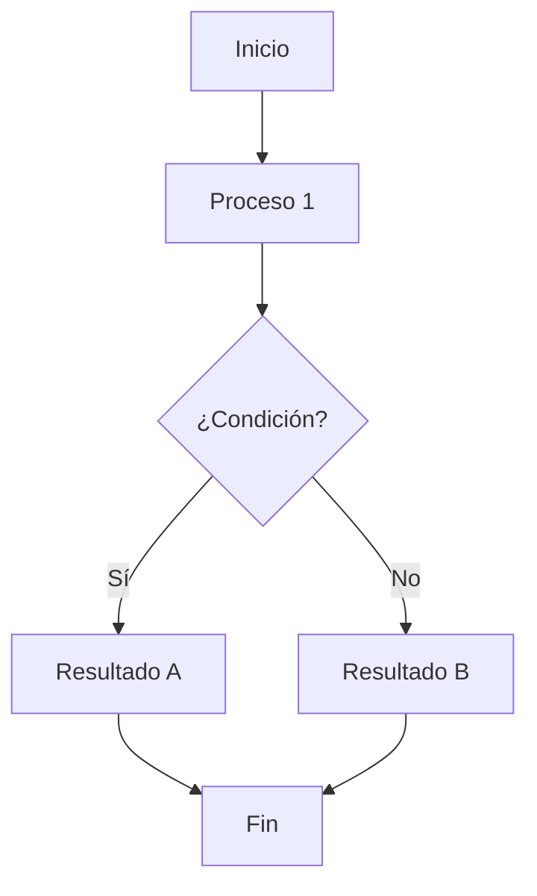

<!--- Uso HTML para poner una imagen ya que en Markdown no puedo alinearla a la derecha aunque he pensado usar algún truco
como rellenar con espacios en blanco o insertar una imagen transparente delante, me parecía un poco cutre--->


# Rodrigo Gómez Fernández
## Estudiante a tiempo parcial <br> CIFPD "La Conservera" Ceutí 📖


⏳Cargando...⏳
-[X] Iniciando curso
    -[]Bases de datos
    -[]Programación
    -[]Lenguajes de marcas

## Trabajador apasionado del campo



```mermaid
graph TD;
    A[Inicio] --> B[Proceso 1];
    B --> C{¿Condición?};
    C -->|Sí| D[Resultado A];
    C -->|No| E[Resultado B];
    D --> F[Fin];
    E --> F;
```

```flow
st=>start: Campo
op1=>operation: Uso de acricultura de precisión y nuevas tecnologías
cond1=>condition: ¿ Ha mejorado la producción Si No?
op2=>operation: 
e=>end: Éxito

st->op1->cond1
cond(Si)->op2
cond(No)->op1

st->op2->cond2
cond(Si)->end
cond(No)->op2
```
```flow
st=>start: Login
op=>operation: Login operation
cond=>condition: Successful Yes or No?
e=>end: To admin

st->op->cond
cond(yes)->e
cond(no)->op
```

<!--- Emojis para posible uso 🌱 🎓 📖 🌄 --->
